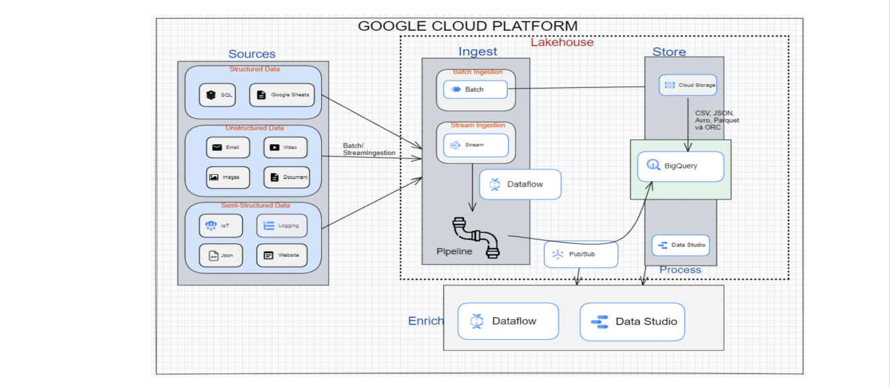

# IS353 - Social networks

  Components Architecture

## Table of contents

### I - Implemented content:
#### 1. Learn big data deployment technologies.
  + Select technology to learn: Google Cloud Platform.
  + Overview of GCP.
  + Evaluate advantages and disadvantages and applications.
  + How to deploy components according to big data architecture, demo examples.

#### 2. Supported big data architecture: Lakehouse analytics selection team
  + How to deploy components according to big data architecture, demo example: Reference document links.
  + Prepare work assignment tables and plans.
  + Implementation support documents (link): data warehouse, data lake, lakehouse.

#### 3. Big data architecture components, demo examples
  + Data sources.
  + Ingest.
  + Process.
  + Enrich.

#### 4. Implement the topic
  + Select dataset as Stack Overflow data to deploy.
  + Run components one after another.
  + There are scripts and code included.
  + Demo examples, reference documents.

### II - Organize DAMH (Project) folder:
#### 1. Document
Project report (including doc files, slides and their pdf versions).

#### 2. Technology
  + ReadMe.txt.
  + Demo videos. (with subtitles and some videos uploaded to Youtube).
  + Scripts, codes corresponding to the running components.

#### 3. Project
  + Information describing the selected Dataset.
  + Related books have sample code to run to make videos.

#### 4. Final-Video 
(All participating members report in the video, open the camera).

#### 5. Plan 
  + General demo scenario.

There is also a job assignment sheet for each member.
